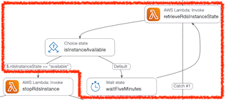

# Stay Stopped, RDS and Aurora!

_Reliably keep AWS databases stopped when not needed, to save money_

## Purpose

You can keep an EC2 compute instance stopped as long as you want, but it's not
possible to stop an RDS or Aurora database longer than 7 days. After AWS
starts your database on the 7th day, this tool automatically stops it again.

### Use Cases

- testing
- development
- infrequent reference
- old databases kept just in case
- vacation or leave beyond one week

If it would cost too much to keep a database running but take too long to
re-create it, this tool might save you money, time, or both. AWS does not
charge for database instance hours while an
[RDS database instance is stopped](https://docs.aws.amazon.com/AmazonRDS/latest/UserGuide/USER_StopInstance.html#USER_StopInstance.Benefits)
or an
[Aurora database cluster is stopped](https://docs.aws.amazon.com/AmazonRDS/latest/AuroraUserGuide/aurora-cluster-stop-start.html#aurora-cluster-start-stop-overview).
(Other charges, such as for storage and snapshots, continue.)

Jump to:
[Get Started](#get-started)
&bull;
[Multi-Account, Multi-Region](#multi-account-multi-region)
&bull;
[Terraform](#terraform)
&bull;
[Security](#security)

## Design

_[**NEW!**
[github.com/sqlxpert/**step**-stay-stopped-aws-rds-aurora](https://github.com/sqlxpert/step-stay-stopped-aws-rds-aurora#step-stay-stopped-rds-and-aurora)
is a<wbr/>
low-code, Step Function-based implementation of the same process.]_

[](media/stay-stopped-aws-rds-aurora-flow-simple.png?raw=true "Simplified flowchart for [Step-]Stay Stopped, RDS and Aurora!")

- You do not need to set any opt-in or opt-out tags. If a database has been
  running continuously, it  will keep running. If it was stopped for 7 days,
  Stay-Stopped will stop it again. The tool responds to
  [RDS-EVENT-0154](https://docs.aws.amazon.com/AmazonRDS/latest/UserGuide/USER_Events.Messages.html#RDS-EVENT-0154)
  (RDS database instance)
  and
  [RDS-EVENT-0153](https://docs.aws.amazon.com/AmazonRDS/latest/AuroraUserGuide/USER_Events.Messages.html#RDS-EVENT-0153)
  (Aurora database cluster).

- Before you start a database manually, wait until it has been stopped for
  10 minutes.

- <a name="design-idempotence"></a>Stopping stuff is inherently
  idempotent: keep trying until it stops! Stay-Stopped tries every 9 minutes
  until the database is stopped, an unexpected error occurs, or 24 hours pass.

  > Many alternatives (including AI-generated ones from Amazon Q Developer)
  introduce a latent bug (a
  [race condition](https://en.wikipedia.org/wiki/Race_condition))
  by checking status _before_ trying to stop a database, always expecting to
  catch the database while it's `available`, or not waiting long enough. To
  understand why this matters and what can go wrong, see
  [Perspective](#perspective),
  below.

- It's not enough to call `stop_db_instance` or `stop_db_cluster` and hope for
  the best. This tool handles error cases. Look for a queue message or a log
  entry, in case something unexpected prevented stopping your database.
  [Budget alerts](https://docs.aws.amazon.com/cost-management/latest/userguide/budgets-action-configure.html)
  and
  [cost anomaly detection](https://docs.aws.amazon.com/cost-management/latest/userguide/manage-ad.html)
  are still essential.

- Once in a while it's still important to start a database before its
  maintenance window and leave it running until the window closes.

### Detailed Diagram

Click to view the architecture diagram and flowchart:

[](media/stay-stopped-aws-rds-aurora-architecture-and-flow.png?raw=true "Architecture diagram and flowchart for Stay Stopped, RDS and Aurora!")

## Get Started

 1. Log in to the AWS Console as an administrator. Choose an AWS account and a
    region where you have an RDS or Aurora database that is normally stopped,
    or that you can stop now and leave stopped for 8 days.

 2. Create a
    [CloudFormation stack](https://console.aws.amazon.com/cloudformation/home)
    "With new resources (standard)". Select "Upload a template file", then
    select "Choose file" and navigate to a locally-saved copy of
    [stay_stopped_aws_rds_aurora.yaml](/stay_stopped_aws_rds_aurora.yaml?raw=true)
    [right-click to save as...]. On the next page, set:

    - Stack name: `StayStoppedRdsAurora`

 3. Wait 8 days, then check that your
    [RDS or Aurora database](https://console.aws.amazon.com/rds/home#databases:)
    is stopped. After clicking the RDS database instance name or the Aurora
    database cluster name, open the "Logs & events" tab and scroll to "Recent
    events". At the right, click to change "Last 1 day" to "Last 2 weeks". The
    "System notes" column should include the following entries, listed here
    from newest to oldest. There might be other entries in between.

    |RDS|Aurora|
    |:---|:---|
    |DB instance stopped|DB cluster stopped|
    |DB instance started|DB cluster started|
    |DB instance is being started due to it exceeding the maximum allowed time being stopped.|DB cluster is being started due to it exceeding the maximum allowed time being stopped.|

    > If you don't want to wait 8 days, see
    [Testing](#testing),
    below.

## Multi-Account, Multi-Region

For reliability, Stay-Stopped works independently in each region, in each AWS
account. To deploy in multiple regions and/or multiple AWS accounts,

 1. Delete any standalone `StayStoppedRdsAurora` CloudFormation _stacks_ in
    your target regions and/or AWS accounts.

 2. Complete the prerequisites for creating a _StackSet_ with
    [service-managed permissions](https://docs.aws.amazon.com/AWSCloudFormation/latest/UserGuide/stacksets-orgs-enable-trusted-access.html).

 3. In the management AWS account (or a delegated administrator account),
    create a
    [CloudFormation StackSet](https://console.aws.amazon.com/cloudformation/home#/stacksets).
    Select "Upload a template file", then select "Choose file" and upload a
    locally-saved copy of
    [stay_stopped_aws_rds_aurora.yaml](/stay_stopped_aws_rds_aurora.yaml?raw=true)
    [right-click to save as...]. On the next page, set:

    - StackSet name: `StayStoppedRdsAurora`

 4. Two pages later, under "Deployment targets", select "Deploy to
    Organizational Units". Enter your target `ou-` identifier. Stay-Stopped
    will be deployed in all AWS accounts in your target OU. Toward the bottom
    of the page, specify your target region(s).

## Terraform

Terraform users are often willing to wrap a CloudFormation stack in HashiCorp
Configuration Language, because AWS supplies tools in the form of
CloudFormation templates. See
[aws_cloudformation_stack](https://registry.terraform.io/providers/hashicorp/aws/latest/docs/resources/cloudformation_stack)
.

Wrapping a CloudFormation StackSet in HCL is much easier than configuring and
using Terraform to deploy and maintain identical resources in multiple regions
and/or AWS accounts. See
[aws_cloudformation_stack_set](https://registry.terraform.io/providers/hashicorp/aws/latest/docs/resources/cloudformation_stack_set)
.

## Security

> In accordance with the software license, nothing in this document establishes
indemnification, a warranty, assumption of liability, etc. Use this software
entirely at your own risk. You are encouraged to review the source code.

<details>
  <summary>Security details...</summary>

### Security Design Goals

- A least-privilege role for the AWS Lambda function.

- Least-privilege queue policies. The main queue can only consume messages
  from EventBridge and produce messages for the Lambda function, or for the
  error (dead letter) queue if there is a problem. Encryption in transit is
  required.

- Optional encryption at rest with the AWS Key Management System, for the
  queues and the log. This can protect EventBridge events containing database
  identifiers and metadata, such as tags. KMS keys housed in a different AWS
  account, and multi-region keys, are supported.

- No data storage other than in the queues and the log, both of which have
  configurable retention periods.

- A retry mechanism (every 9 minutes) and limit (160 total times, which is 24
  hours), to increase the likelihood that a database will be stopped as
  intended but prevent endless retries.

- A concurrency limit, to prevent exhaustion of available Lambda resources.

- A 24-hour event date/time expiry check, to prevent processing of accumulated
  stale events, if any.

- Readable Identity and Access Management policies, formatted as
  CloudFormation YAML rather than JSON, and broken down into discrete
  statements by service, resource or principal.

### Your Security Steps

- Prevent people from modifying components of this tool, most of which can be
  identified by `StayStoppedRdsAurora` in ARNs and in the automatic
  `aws:cloudformation:stack-name` tag.

- Log infrastructure changes using CloudTrail, and set up alerts.

- Prevent people from directly invoking the Lambda function and from passing
  the function role to arbitrary functions.

- Separate production workloads. Although this tool only stops databases that
  _AWS_ is starting after they've been stopped for 7 days, the Lambda function
  could stop _any_ database if invoked directly, with a contrived event as
  input. You might choose not to deploy this tool in AWS accounts used for
  production, or you might add a custom IAM policy to the function role,
  denying authority to stop certain production databases (`AttachLocalPolicy`
  in CloudFormation).

  - Tagging an RDS database instance or an Aurora database cluster with
    `StayStopped-Exclude` (see `ExcludeTagKey` in CloudFormation) prevents the
    Lambda function role from being misused to stop that database.
    &#9888; Do not rely on
    [attribute-based access control](https://docs.aws.amazon.com/IAM/latest/UserGuide/introduction_attribute-based-access-control.html)
    unless you also prevent people and systems from adding, changing and
    deleting ABAC tags.

- Enable the test mode only in a non-critical AWS account and region, and turn
  the test mode off again as quickly as possible.

- Monitor the error (dead letter) queue, and monitor the log for `ERROR`-level
  entries.

- Configure [budget alerts](https://docs.aws.amazon.com/cost-management/latest/userguide/budgets-action-configure.html)
  and use
  [cost anomaly detection](https://docs.aws.amazon.com/cost-management/latest/userguide/manage-ad.html).

- Occasionally start a database before its maintenance window and leave it
  running, to catch up with RDS and Aurora security updates.

</details>

## Troubleshooting

Check the:

 1. [StayStoppedRdsAurora-LambdaFn CloudWatch log group](https://console.aws.amazon.com/cloudwatch/home#logsV2:log-groups$3FlogGroupNameFilter$3DStayStoppedRdsAurora-LambdaFn)
    - Scrutinize log entries at the `ERROR` level:

      `InvalidDBInstanceState` or `InvalidDBClusterStateFault` :

      - One time:
        A database could not be stopped because it was in an unexpected state.
      - Multiple times for the same database:
        The database was in an unexpected but potentially recoverable state.
        Stay-Stopped retries every 9 minutes, until 24 hours have passed.

    - Log entries are JSON objects.
      - Stay-Stopped includes `"level"` , `"type"` and `"value"` keys.
      - Other software components may use different keys.
    - For more data, change the `LogLevel` in CloudFormation.

 2. `StayStoppedRdsAurora-ErrorQueue` (dead letter)
    [SQS queue](https://console.aws.amazon.com/sqs/v3/home#/queues)
    - A message in this queue means that Stay-Stopped did not stop a database,
      usually after trying for 24 hours.
    - The message will usually be the original EventBridge event from when AWS
      started the database after it had been stopped for 7 days.
    - Rarely, a message in this queue indicates that the local security
      configuration is denying necessary access to SQS or Lambda.

 3. [CloudTrail Event history](https://console.aws.amazon.com/cloudtrailv2/home?ReadOnly=false/events#/events?ReadOnly=false)
    - CloudTrail events with an "Error code" may indicate permissions
      problems,
      typically due to the local security configuration.
    - To see more events, change "Read-only" from `false` to `true` .

## Testing

<details>
  <summary>Testing details...</summary>

### Recommended Test Database

An RDS database instance ( `db.t4g.micro` , `20` GiB of gp3 storage, `0` days'
worth of automated backups) is cheaper than a typical Aurora cluster, not to
mention faster to create, stop, and start.

### Test Mode

AWS starts RDS and Aurora databases that have been stopped for 7 days, but we
need a faster mechanism for realistic, end-to-end testing. Temporarily change
these parameters in CloudFormation:

|Parameter|Normal|Test|
|:---|:---:|:---:|
|`Test`|`false`|`true`|
|`LogLevel`|`ERROR`|`INFO`|
|`QueueDelaySecs`|`540`|`60`|
|&rarr; _Equivalent in minutes_|_9 minutes_|_1 minute_|
|`QueueVisibilityTimeoutSecs`|`540`|`60`|
|`QueueMaxReceiveCount`|`160`|`30`|
|&rarr; _Equivalent time_|_24 hours_|_30 minutes_|
|`CreateLambdaTestEvents`|`false`|`true` _if&nbsp;desired_|

**&#9888; Exit test mode as quickly as possible**, given the operational and
security risks explained below. If your test database is ready, several minutes
should be sufficient.

### Test by Manually Starting a Database

In test mode, Stay-Stopped responds to user-initiated, non-forced database
starts, too:
[RDS-EVENT-0088 (RDS database instance)](https://docs.aws.amazon.com/AmazonRDS/latest/UserGuide/USER_Events.Messages.html#RDS-EVENT-0088)
and
[RDS-EVENT-0151](https://docs.aws.amazon.com/AmazonRDS/latest/AuroraUserGuide/USER_Events.Messages.html#USER_Events.Messages.cluster)
(Aurora database cluster). Although it won't stop databases that are already
running and remain running, **&#9888; while in test mode Stay-Stopped will
stop databases that you start manually**. To test, manually
start a stopped
[RDS or Aurora database](https://console.aws.amazon.com/rds/home#databases:).

> In test mode, Stay-Stopped also receives
[RDS-EVENT-0088 (Aurora database instance)](https://docs.aws.amazon.com/AmazonRDS/latest/AuroraUserGuide/USER_Events.Messages.html#RDS-EVENT-0088).
Internally, the code ignores it in favor of the cluster-level event.

### Test by Sending a Message

Test mode relaxes the queue policy for the main SQS queue, allowing sources
other than EventBridge, and targets other than the Lambda function or the
error (dead letter) queue. Test by using the AWS Console to send a simulated
EventBridge event message. In the list of
[SQS queues](https://console.aws.amazon.com/sqs/v3/home#/queues),
select `StayStoppedRdsAurora-MainQueue` and then select the "Send and receive
messages" button above the list. You can:

- "Send message", or
- "Poll for messages", select a message, read it and delete it, or
- "Purge" all messages.

Edit the database names and date/time strings (must be within the past
`QueueMaxReceiveCount` &times; `QueueVisibilityTimeoutSecs` and end in `Z` for
[UTC](https://www.timeanddate.com/worldclock/timezone/utc))
in these test messages:

```json
{
  "detail": {
    "SourceIdentifier": "Name-Of-Your-RDS-Database-Instance",
    "Date": "2025-06-06T04:30Z",
    "SourceType": "DB_INSTANCE",
    "EventID": "RDS-EVENT-0154"
  },
  "detail-type": "RDS DB Instance Event",
  "source": "aws.rds",
  "version": "0"
}
```

```json
{
  "detail": {
    "SourceIdentifier": "Name-Of-Your-Aurora-Database-Cluster",
    "Date": "2025-06-06T04:30Z",
    "SourceType": "CLUSTER",
    "EventID": "RDS-EVENT-0153"
  },
  "detail-type": "RDS DB Cluster Event",
  "source": "aws.rds",
  "version": "0"
}
```

### Test by Invoking the Lambda Function

Depending on locally-determined permissions, you may also be able to invoke
the
[StayStopped Lambda function](https://console.aws.amazon.com/lambda/home#/functions?fo=and&o0=%3A&v0=StayStoppedRdsAurora-LambdaFn-)
manually.

A
[Lambda shareable test event](https://docs.aws.amazon.com/lambda/latest/dg/testing-functions.html#creating-shareable-events)
is provided. To opt in, see the `CreateLambdaTestEvents` CloudFormation
parameter. In the Lambda function's "Test" tab, the test event will appear in
the "Event name" pop-up menu, in the "Shareable saved events" section, as
`RdsAndAurora_EditFirst`&nbsp;.

You can also create private or shareable test events independently, by
copying the JSON object below.

Whether you use the provided shareable test event or create your own private or
shareable test events, you must edit the database name(s) and the date/time
string(s). The date/time string(s) must be within the past
`QueueMaxReceiveCount`&nbsp;&times;&nbsp;`QueueVisibilityTimeoutSecs`
(24&nbsp;hours, by default) and must end in `Z` for
[UTC](https://www.timeanddate.com/worldclock/timezone/utc).

```json
{
  "Records": [
    {
      "body": "{ \"detail\": { \"SourceIdentifier\": \"Name-Of-Your-RDS-Database-Instance\", \"Date\": \"2025-06-06T04:30Z\", \"SourceType\": \"DB_INSTANCE\", \"EventID\": \"RDS-EVENT-0154\" }, \"detail-type\": \"RDS DB Instance Event\", \"source\": \"aws.rds\", \"version\": \"0\"}",
      "messageId": "test-message-1-rds"
    },
    {
      "body": "{ \"detail\": { \"SourceIdentifier\": \"Name-Of-Your-Aurora-Database-Cluster\", \"Date\": \"2025-06-06T04:30Z\", \"SourceType\": \"CLUSTER\", \"EventID\": \"RDS-EVENT-0153\" }, \"detail-type\": \"RDS DB Cluster Event\", \"source\": \"aws.rds\", \"version\": \"0\"}",
      "messageId": "test-message-2-aurora"
    }
  ]
}
```

### Report Bugs

After following the
[troubleshooting](#troubleshooting)
steps and ruling out local issues such as permissions &mdash; especially
hidden controls such as Service and Resource control policies (SCPs and RCPs)
&mdash; please
[report bugs](/../../issues). Thank you!

</details>

## Perspective

As noted in the Design section, many alternative solutions (including
AI-generated ones from Amazon Q Developer) introduce a latent bug (a
[race condition](https://en.wikipedia.org/wiki/Race_condition))
by checking status _before_ trying to stop a database, always expecting to
catch the database while it's `available`, or not waiting long enough.

<details>
  <summary>About idempotence, race conditions, and latent bugs...</summary>

<br/>
Let's compare two thoughtful alternative solutions, described as of May, 2025,
then Stay-Stopped, and finally, a series of AI-generated solutions from June,
2025...

### Pure Lambda Alternative

[Stop Amazon RDS/Aurora Whenever They Start](https://aws.plainenglish.io/stop-amazon-rds-aurora-whenever-they-start-with-lambda-and-eventbridge-c8c1a88f67d6)
\[[code](https://gist.github.com/shimo164/cc9bb3c425e13f0f2fa14f29c633aa84/0e714a830352e6e6d29904e0629b82df5473393f)\]
by shimo, from the _AWS in Plain English_ blog on Medium, comprises a single
Lambda function, which checks that the database is `available` before stopping
it
([L48-L51](https://gist.github.com/shimo164/cc9bb3c425e13f0f2fa14f29c633aa84/0e714a830352e6e6d29904e0629b82df5473393f#file-lambda_stop_rds-py-L48-L51)).
If not, the code waits
([L63-L65](https://gist.github.com/shimo164/cc9bb3c425e13f0f2fa14f29c633aa84/0e714a830352e6e6d29904e0629b82df5473393f#file-lambda_stop_rds-py-L63-L65))
and checks again
([L76-L78](https://gist.github.com/shimo164/cc9bb3c425e13f0f2fa14f29c633aa84/0e714a830352e6e6d29904e0629b82df5473393f#file-lambda_stop_rds-py-L76-L78)).
What if the database takes a long time to start? Startup "can take minutes to
hours", according to the
[RDS User Guide](https://docs.aws.amazon.com/AmazonRDS/latest/UserGuide/USER_StartInstance.html).
[Lambda has a 15-minute maximum timeout](https://docs.aws.amazon.com/lambda/latest/dg/configuration-timeout.html).
The function might never get a chance to request that the database be stopped.

> Waiting within the Lambda function might seem wasteful, but 15 minutes costs
less than 2¢ &mdash; negligible for a function triggered once per database per
week. Though Lambda's maximum timeout is too short for this application, I
appreciate the author's instinct for minimal infrastructure.

### Step Function Alternative

[Stopping an Automatically Started Database Instance](https://aws.amazon.com/jp/blogs/architecture/field-notes-stopping-an-automatically-started-database-instance-with-amazon-rds/)
\[[code](https://github.com/aws-samples/amazon-rds-auto-restart-protection/tree/cfdd3a1)\]
by Islam Ghanim, on AWS's own _Architecture Blog_, uses an AWS Step Function.
Before attempting to stop the database, the state machine waits as long as
necessary for the database to become `available`; long `maintenance` etc.
would be accommodated. After the database finishes `starting` and becomes
`available`, what if someone notices and stops it manually, putting it in
`stopping` status before the next status check? Barring an error, `available`
is the _only_ way out of the status check loop
([stop-rds-instance-state-machine.json L30-L40](https://github.com/aws-samples/amazon-rds-auto-restart-protection/blob/cfdd3a1/sources/stepfunctions-code/stop-rds-instance-state-machine.json#L30-L40)).
No
[state machine timeout](https://docs.aws.amazon.com/step-functions/latest/dg/statemachine-structure.html#statemachinetimeoutseconds)
is defined
([L1-L4](https://github.com/aws-samples/amazon-rds-auto-restart-protection/blob/cfdd3a1/sources/stepfunctions-code/stop-rds-instance-state-machine.json#L1-L4)).
The Step Function would keep checking every 5 minutes for a status that won't
recur until AWS starts the database again in 7 days or, worse yet, someone
starts the database manually _with the intention of using it_.

> What I appreciate about this author's solution is that once the stop request
is made, the state machine sees it through until the database's status changes
from `stopping` to `stopped`.

[](media/aws-architecture-blog-stop-rds-instance-state-machine-annotated.png?raw=true "Annotated state machine from the AWS Architecture Blog solution")

### Stay-Stopped: Queue Before Lambda

_[ Note: The Step Function solution discussed above is not related to<wbr/>
my own
[github.com/sqlxpert/**step**-stay-stopped-aws-rds-aurora](https://github.com/sqlxpert/step-stay-stopped-aws-rds-aurora#step-stay-stopped-rds-and-aurora)&nbsp;.]_

Stay-Stopped requires only one Lambda function, but inserts an SQS queue
between EventBridge and Lambda. Waiting occurs outside the Lambda function.
SQS counts up toward a
[first-time message delivery delay](https://docs.aws.amazon.com/AWSSimpleQueueService/latest/SQSDeveloperGuide/sqs-delay-queues.html).
Later, SQS counts up toward a
[message [in]visibility timeout](https://docs.aws.amazon.com/AWSSimpleQueueService/latest/SQSDeveloperGuide/sqs-visibility-timeout.html),
making it possible to periodically retry the Lambda function, with the
original EventBridge event message, until the return value indicates success.
If
[maxReceiveCount](https://docs.aws.amazon.com/AWSSimpleQueueService/latest/SQSDeveloperGuide/sqs-dead-letter-queues.html#policies-for-dead-letter-queues)
is reached instead, SQS gives up and moves the message to a dead letter queue.
Between the first-time delivery delay, the [in]visibility timeout, and the
receive count, SQS maintains all the state that's needed.

Given that the Lambda function receives the _original_ event message again
and again, how does Stay-Stopped track the database's progress from `starting`
to `available` (the only status from which it can be stopped) and then to
`stopped` (or another final status)? It doesn't. One idempotent Lambda
function does the same thing each time it's invoked, avoiding the need for a
Step Function state machine.

> Interestingly, the RDS API is eventually consistent, not strongly consistent.
After RDS emits a "DB cluster is being started" or "DB instance is being
started" event, `stop_db_cluster` or `stop_db_instance` and
`describe_db_instances` might still see the database's stale `stopped` status
rather than its current `starting` status. The first-time message delivery
delay has been added for this reason.

Each time the Lambda function is invoked, it tries to stop the database by
calling `stop_db_cluster` (for an Aurora event) or `stop_db_instance` (for
RDS). Unlike a request to stop an EC2 compute instance, which succeeds even if
the EC2 instance is stopping or already stopped, a request to stop an RDS
database instance or an Aurora database cluster fails if the database is
`stopping` or already `stopped`. More importantly, it also fails if the
database is in `maintenance` or another similar status, and not ready to be
stopped.

 1. Aurora mentions whatever offending database status in the error message:

    > An error occurred (InvalidDBClusterStateFault) when calling the
    StopDBCluster operation: DbCluster Name-Of-Your-Aurora-Database-Cluster
    **is in stopping state** but expected it to be one of available.

    There is no point in checking the status of an Aurora database, separately
    and non-atomically, when the goal is to stop it. Keep trying to stop it,
    and the error message will reveal when it is finally stopped.

 2. RDS, on the other hand, omits the offending database status:

    > An error occurred (InvalidDBInstanceState) when calling the
    StopDBInstance operation: Instance Name-Of-Your-RDS-Database-Instance
    **is not in available state**.

    After receiving this error, the Stay-Stopped Lambda function calls
    `describe_db_instances` to find out the status of the RDS database. Does
    the fact that the stop request and the status request are always separate,
    non-atomic operations (with no provision for locking control of the
    database in between) make a race condition inevitable with RDS? As long as
    we always stop first and ask questions later, we have done our best.

A success response from `stop_db_cluster` or `stop_db_instance` is _not_
success for the Lambda function. Unless the database is in a final status such
as `stopped`, the Lambda function
[returns a batch item failure](https://docs.aws.amazon.com/lambda/latest/dg/services-sqs-errorhandling.html#services-sqs-batchfailurereporting).
Batches are unlikely in this application, but partial batch responses provide
a way to provoke retries, short of raising an exception or calling
`sys.exit(1)`, either of which would needlessly
[provoke the shutdown and re-initialization of the Lambda runtime environment](https://docs.aws.amazon.com/lambda/latest/dg/lambda-runtime-environment.html#runtimes-lifecycle-invoke-with-errors).

> If someone starts the database manually after it enters `stopped` status but
before the next and final retry, Stay-Stopped will stop the database another
time &mdash; a race condition, yes, but documented, and not one that prevents
the tool from doing its job of stopping databases! Before manually starting a
database, wait until it has been stopped for 10 minutes (based on the tool's
default [in]visibility timeout, 9 minutes). Or, change `FollowUntilStopped` to
`false` in CloudFormation.

### Amazon Q Artificial Intelligence Solutions

After finishing Stay-Stopped, I decided to check whether
[Amazon Q Developer](https://docs.aws.amazon.com/amazonq/latest/qdeveloper-ug/software-dev.html)
might have helped with its development. This section is so dispiriting that
I'm folding it. Read on, if you dare!

<details>
  <summary>Details of the AI-generated solutions...</summary>

<br/>

Jump to:

- [An Unnecessary Call for Every Database](#an-unnecessary-call-for-every-database)
- [The Wrong Event](#the-wrong-event)
- [Waiting within the Lambda](#waiting-within-the-lambda)
- ["Fixing" a Race Condition by Adding Another](#fixing-a-race-condition-by-adding-another)
- [Spaghetti Code and Meatballs](#spaghetti-code-and-meatballs)
- [Still Unnecessary Code](#still-unnecessary-code)
- [Leaving a Bug for Later](#leaving-a-bug-for-later)
- [Would Amazon Q Developer Have Helped?](#would-amazon-q-developer-have-helped)

Amazon Q Developer's initial response to my prompt to write a Lambda function
that keeps RDS databases stopped longer than 7 days didn't handle events at
all. It drew a list of databases from `describe_db_instances` and called
`stop_db_instance` on `available` ones that had been created more than 7 days
ago &mdash; disaster!

#### An Unnecessary Call for Every Database

The code repeated mistakes found all over the Internet and in
[official AWS solutions on re:Post](https://repost.aws/knowledge-center/rds-stop-seven-days).
The following exchange is telling:

> Why does the Lambda function call `list_tags_for_resource` after calling
`describe_db_instances`?

```plaintext
[...] because AWS RDS API doesn't include tags in the response of
describe_db_instances by default. [...]

• Tags are considered metadata that's managed separately from the core instance 
properties
• It helps keep the primary describe call response size smaller and more focused
• It follows AWS's general pattern of separating resource information from tag
information across many services
```

I knew from my own work that this had changed years ago.

> According to
[boto3 / RDS / Client / describe_db_instances](https://boto3.amazonaws.com/v1/documentation/api/latest/reference/services/rds/client/describe_db_instances.html),
`describe_db_instances` does include tags in its response.

```plaintext
You're absolutely right, and I apologize for my error. Looking at the boto3
documentation for describe_db_instances, it does indeed include tags in its
response.
```

#### The Wrong Event

I asked about events. Amazon Q Developer drafted this:

```yaml
Pattern:
  source:
    - aws.rds
  detail-type:
    - 'RDS DB Instance Event'
  detail:
    EventCategories:
      - availability
    Message:
      - prefix: "DB instance restarted"
      - prefix: "DB instance has been restarted"
      - prefix: "DB instance is available"
```

The last two messages don't exist, which leaves one matching event,
[RDS-EVENT-0006](https://docs.aws.amazon.com/AmazonRDS/latest/UserGuide/USER_Events.Messages.html#RDS-EVENT-0006),
"DB instance restarted." It occurs in situations other than when AWS starts a
database that has been stopped for 7 days.

I took pity on Amazon Q Developer and mentioned
[RDS-EVENT-0154](https://docs.aws.amazon.com/AmazonRDS/latest/UserGuide/USER_Events.Messages.html#RDS-EVENT-0154),
"DB instance is being started due to it exceeding the maximum allowed time
being stopped."

#### Waiting within the Lambda

> But how long does the RDS documentation say that it can take to start a
> stopped DB instance?

```plaintext
According to the AWS RDS documentation, starting a stopped DB instance
typically takes several minutes. The exact time can vary depending on the
instance size, storage type, and database engine, but generally it's in the
range of 5-10 minutes for most standard configurations.
```

Nonsense!

> [RDS User Guide / Starting an Amazon RDS DB instance that was previously stopped](https://docs.aws.amazon.com/AmazonRDS/latest/UserGuide/USER_StartInstance.html)
says "The startup process can take minutes to hours."

```plaintext
Looking at the AWS documentation you've linked, you're absolutely right - the
RDS startup process can take anywhere from "minutes to hours" depending on
various factors.
[...]
Given Lambda's execution time limitations (maximum of 15 minutes), we can't 
reliably wait for an RDS instance to complete startup within a single Lambda 
invocation. Here are our best options:

### Option 1: Step Functions State Machine
[...]

### Option 2: SQS-based Retry with Dead Letter Queue
[...]

### Option 3: EventBridge Scheduled Rule
1. When RDS-EVENT-0154 is received, tag the instance and create a new 
EventBridge rule
2. The rule runs every 5-10 minutes and targets a Lambda function
3. The Lambda checks if the tagged instance is available and stops it
4. Once successful, the Lambda deletes the EventBridge rule
[...]

### Option 4: DynamoDB-based Tracking
1. Store instance IDs in DynamoDB with timestamp and attempt count
2. Run a Lambda on a schedule to check all instances in the table
3. Update attempt count and last check time after each attempt
[...]
```

Option 3 requires risky self-modifying infrastructure, and Option 4 is like a
"distractor" response for a test question meant to distinguish system
administration from DevOps. If a `cron` job is no longer right, why would
running "a Lambda on a schedule" make sense?

#### "Fixing" a Race Condition by Adding Another

> Does this Lambda function have a race condition?

```plaintext
Looking at the Lambda function code, there is a potential race condition in how
it handles RDS instance state changes.
[...]
1. Event Processing Delay: There might be a delay between when AWS restarts the 
instance and when our Lambda processes the event
2. Concurrent Executions: If multiple events for the same instance are
triggered close together, we might have concurrent Lambda executions trying to
stop the same instance
3. No State Locking: The function doesn't implement any locking mechanism to 
prevent concurrent operations on the same instance
```

Amazon Q Developer offered to add a second `describe_db_instances` call,
unwittingly adding a second race condition!

```python
  try:
    instance_response = rds.describe_db_instances(DBInstanceIdentifier=source_id)
    # [...]
    instance = instance_response['DBInstances'][0]
    instance_id = instance['DBInstanceIdentifier']
    instance_status = instance['DBInstanceStatus']
    # [...]
    # Check if instance is available (running)
    if instance_status == 'available':
      logger.info(f"Instance {instance_id} is available, stopping it")
      # [...]
      try:
        # Double-check instance state before stopping
        current_state_response = rds.describe_db_instances(DBInstanceIdentifier=instance_id)
        current_state = current_state_response['DBInstances'][0]['DBInstanceStatus']
        # [...]
        if current_state != 'available':
```

> I claim that this approach still has a fundamental race condition. Does this
article give you a hint?
[Making retries safe with idempotent APIs](https://aws.amazon.com/builders-library/making-retries-safe-with-idempotent-APIs/)

```plaintext
You're absolutely right to bring up idempotency concerns. Looking at the AWS
Builder's Library article on "Making retries safe with idempotent APIs," I can
see the race condition in our approach.

[...] we need to:

1. Use a client token or request ID that remains consistent for retries of the
same logical operation
2. Track the state of operations to avoid duplicate actions
3. Handle all possible states the instance could be in, not just "available"

For example, if we see the instance is in "stopping" state, we should recognize 
this as a successful previous attempt and not try to stop it again.
```

> Does a client token really help? What if, while SQS and Lambda are waiting
between invocations (during the visibility timeout), a human being notices
that the DB instance is available, and stops it manually?

```plaintext
You've raised an excellent point about the limitations of client tokens [...]

If a human manually stops the instance while our system is waiting between 
invocations during the visibility timeout, a client token wouldn't detect this 
external intervention. The client token only helps ensure that our specific API
call isn't processed multiple times by AWS, but it doesn't help us detect or
handle state changes caused by external actors.

The true idempotent approach here needs to be state-based rather than token-
based. What matters is the desired end state (the instance being stopped), not 
whether our specific API call was the one that caused it.
```

#### Spaghetti Code and Meatballs

Static analysis tools are excellent sources of _free_ advice. I'd expect the
free variant of a $19 per person per month artificial intelligence bot to be
smart enough to use them.
[pylint](https://www.pylint.org/)
said of Amazon Q Developer's code,

- Too many local variables (22/15) (`too-many-locals`)
- Too many nested blocks (8/5) (`too-many-nested-blocks`)
- Too many branches (28/12) (`too-many-branches`)

At least there are comments to help. I would never have guessed the purpose of
a `stop_db_instance` call bracketed by "Stopping RDS instance" and
"Successfully initiated stop" log strings.

```python
            # Stop the instance
            logger.info(f"Stopping RDS instance {instance_id}")
            try:
              rds.stop_db_instance(DBInstanceIdentifier=instance_id)
              stopped_instances.append({"id": instance_id, "event": "auto-restart"})
              logger.info(f"Successfully initiated stop for instance {instance_id}")
            except rds.exceptions.InvalidDBInstanceStateFault as state_error:
              # Handle the case where instance state changed after our check
              logger.warning(f"Instance {instance_id} state changed before stop operation could complete: {str(state_error)}")
              skipped_instances.append({"id": instance_id, "reason": f"State changed during stop operation: {str(state_error)}"})
            except rds.exceptions.DBInstanceNotFoundFault as not_found_error:
              logger.warning(f"Instance {instance_id} not found when attempting to stop: {str(not_found_error)}")
              skipped_instances.append({"id": instance_id, "reason": f"Instance not found during stop operation"})
            except Exception as e:
              logger.error(f"Error stopping {instance_id}: {str(e)}")
              skipped_instances.append({"id": instance_id, "reason": f"Error during stop: {str(e)}"})
          except Exception as e:
            logger.error(f"Error processing {instance_id}: {str(e)}")
            skipped_instances.append({"id": instance_id, "reason": f"Processing error: {str(e)}"})
        else:
          logger.info(f"DRY RUN: Would have stopped RDS instance {instance_id}")
          stopped_instances.append({"id": instance_id, "event": "auto-restart", "dry_run": True})
      else:
        logger.info(f"Instance {instance_id} is not in 'available' state (current: {instance_status}), skipping")
        skipped_instances.append({"id": instance_id, "reason": f"Not in 'available' state (current: {instance_status})"})
    except Exception as e:
      logger.error(f"Error processing instance {source_id}: {str(e)}")
      return {
        "statusCode": 500,
        "message": f"Error processing instance {source_id}: {str(e)}"
      }
  else:
    logger.info(f"Event for {source_id} is not a restart event, skipping")
    return {
      "statusCode": 200,
      "message": "Event is not a restart event, no action taken"
    }
```

#### Still Unnecessary Code

When the goal is to stop databases that had already been stopped for 7 days,
tags cannot add any information. A previously stopped database is included,
thanks to `RDS-EVENT-0154`. A continuously running database is excluded,
because no event is generated for it. (The only benefit of tags is
[attribute-based access control](https://aws.amazon.com/identity/attribute-based-access-control/),
which is far beyond the level of solutions typically found on the Internet or
initially proposed by Amazon Q Developer.
[github.com/sqlxpert/lights-off-aws uses ABAC](https://github.com/sqlxpert/lights-off-aws/blob/8e45026/cloudformation/lights_off_aws.yaml#L679-L687)
and I've added it to Stay-Stopped as well. It's moot unless you broadly
restrict the right to add, change and delete ABAC tags.)

According to Amazon Q Developer, "The final solution represents a robust,
production-ready approach that properly handles the complexities of keeping
RDS instances stopped even after AWS automatically restarts them." The term
"final solution" is sensitive and should never be used by a code generation
bot. Isn't awareness of context part of intelligence? In any case, the final
_version_ still included:

```python
EXCLUDE_TAGS = os.environ.get('EXCLUDE_TAGS', 'AutoStop=false').split(',')
# [...]
def should_exclude(tags):
    """Check if instance should be excluded based on tags"""
    for tag_filter in EXCLUDE_TAGS:
        if '=' in tag_filter:
            key, value = tag_filter.split('=')
            tag_value = get_tag_value(tags, key)
            if tag_value and tag_value.lower() == value.lower():
                return True
    return False

# [...]

  # Get instance details to check tags
  response = rds.describe_db_instances(DBInstanceIdentifier=source_id)
  # [...]
  instance = response['DBInstances'][0]
  instance_id = instance['DBInstanceIdentifier']
  instance_arn = instance['DBInstanceArn']
  tags = instance.get('TagList', [])
  
  # Check if instance should be excluded based on tags
  if should_exclude(tags):
    # [...]
```

An `RDS-EVENT-0154` follows. I logged it while testing Stay-Stopped. The
EventBridge to SQS to Lambda architecture affords not one but **two zero-code,
zero-effort opportunities** to filter based on event properties, so long as
the criteria are static. Instead of excluding databases tagged
`AutoStop=false` declaratively, by adding one line of CloudFormation YAML to
the existing
[Events::Rule EventPattern](https://docs.aws.amazon.com/AWSCloudFormation/latest/TemplateReference/aws-resource-events-rule.html#cfn-events-rule-eventpattern),
or a few lines to a new
[Lambda::EventSourceMapping FilterCriteria](https://docs.aws.amazon.com/AWSCloudFormation/latest/TemplateReference/aws-resource-lambda-eventsourcemapping.html#cfn-lambda-eventsourcemapping-filtercriteria)
entry, Amazon Q Developer proceeded imperatively, adding an environment
variable, a function, and a `describe_db_instances` call, comprising 14+ extra
lines of executable Python code. My earlier complaint that
`describe_db_instances` does indeed return tags seems to have biased the bot
against `list_tags_for_resource`, which would be appropriate this time &mdash;
if it were necessary to fetch tags and if tags made sense for this
application.

```json
{
  "version": "0",
  "id": "e2a1ff83-facf-130b-0a13-852949c50174",
  "detail-type": "RDS DB Instance Event",
  "source": "aws.rds",
  "account": "111222333444",
  "time": "2025-06-08T04:54:48Z",
  "region": "us-west-2",
  "resources": [
    "arn:aws:rds:us-west-2:111222333444:db:Name-Of-Your-RDS-Database-Instance"
  ],
  "detail": {
    "EventCategories": [
      "notification"
    ],
    "SourceType": "DB_INSTANCE",
    "SourceArn": "arn:aws:rds:us-west-2:111222333444:db:Name-Of-Your-RDS-Database-Instance",
    "Date": "2025-06-08T04:54:48.420Z",
    "Message": "DB instance is being started due to it exceeding the maximum allowed time being stopped.",
    "SourceIdentifier": "Name-Of-Your-RDS-Database-Instance",
    "EventID": "RDS-EVENT-0154",
    "Tags": {
      "test-tag-key": "test-tag-value"
    }
  }
}
```

When I added ABAC to the Stay-Stopped Lambda function role, I took the
liberty of using the same declarative CloudFormation code to condition the
event rule on database tags. I was able to add support for a parameterized
exclusion tag, a parameterized inclusion tag, a mix of both (databases
explicitly included, and some explicitly excluded), or no tags. There is no
need to add or change Lambda function Python code to support tags.

#### Leaving a Bug for Later

One thing I liked about the generated code at first glance was the encoding
scheme for a list of tag=value pairs &mdash; even though, as explained above,
tags are a distraction in this application.

```python
EXCLUDE_TAGS = os.environ.get('EXCLUDE_TAGS', 'AutoStop=false').split(',')
# [...]
  key, value = tag_filter.split('=')
```

Unlike the rest of the generated code, this encoding is syntactically economic,
both for the user and for the programmer. Unfortunately, the choice of `=` as
a delimiter hides a bug and demonstrates that Amazon Q Developer is ignoring
AWS documentation that was available during training and is germane and
queryable now.

Tag restrictions differ from one AWS service to another, and the restrictions
are not documented for all services. RDS tag keys and values have rather
limited character sets, which are documented in
[Tagging Amazon RDS resources: Tag structure in Amazon RDS](https://docs.aws.amazon.com/AmazonRDS/latest/UserGuide/USER_Tagging.html#Overview.Tagging.Structure),
in the _RDS User Guide_. `=` is allowed in RDS tag keys, where it wouldn't make
much sense to humans, and in RDS tag values, where it does make sense. The
original prompt was all about RDS.

My other project,
[github.com/sqlxpert/lights-off-aws](https://github.com/sqlxpert/lights-off-aws#single-terms)&nbsp;,
processes schedule expressions in tag _values_. For clarity to the user as well
as to the programmer, I replaced `cron`'s positional system with label=value
pairs like `d=01 H=07 M=30`, the labels corresponding to
[strftime](https://manpages.ubuntu.com/manpages/noble/man3/strftime.3.html#description)
fields. `=` can also appear in the query part of a URI. Tagging AWS resources
with links to dashboards, documentation or Jira tickets is a good practice.

The simple `AutoStop=false` example works, but an unexpected error would occur
if the user followed RDS's tag rules and included a tag key or value with `=`
when setting `EXCLUDE_TAGS`. Looking ahead, if the generated `split`s entered
a larger codebase and were reused in a broader context, debugging would become
quite difficult. `=` as a delimiter is incorrect for RDS because it's allowed
inside RDS tag keys and tag values. `,` as a delimiter would be incorrect for
EC2, because it's allowed inside EC2 tag keys and tag values. See
[Tag your Amazon EC2 resources: Tag restrictions](https://docs.aws.amazon.com/AWSEC2/latest/UserGuide/Using_Tags.html#tag-restrictions)
in the _EC2 User Guide_.

When I knowingly introduce code that circumscribes a documented capability, it
is my responsibility to warn the user and the programmer. Amazon Q Developer
loves to generate comments, and this would be a good use for one, although the
generated comments are typically manipulations of tokens that speak to
the "what", not to the "why". If Amazon Q Developer preemptively provided, in
the parameter description and in a code comment, a link to the RDS tag
specification and a warning that `=` is not allowed in tag keys or tag values
for this application, the bot would save me time. Better yet, how about
generating reusable code and preventing future bugs by choosing delimiters
that are consistent with the rules in AWS service documentation?

#### Would Amazon Q Developer Have Helped?

No. After multiple revision rounds in which _I_ told Amazon Q Developer about
problems and solutions it should have anticipated based on AWS's own
documentation, the bot's lack of depth was clear. It could have helped with
the _form_ of resource definitions, but not with correct _content_. If you
don't know the extent of the documentation for the AWS services you use, and
haven't read it yourself, you will not be able to assess the accuracy of
Amazon Q Developer's claims. If you don't know distributed systems
programming practices, you will not be able to assess the reliability of the
code that Amazon Q Developer generates. If you don't know general programming
principles, you risk accepting generated code that is long, repetitive, and
hard to maintain.

> I have edited my prompts for brevity and reduced the indentation of the
generated code excerpts for readability. Originals are available on request.
Because the goal was to see whether artificial intelligence could develop a
solution from scratch, replacing an experienced human developer or at least
orienting a novice, I did not provide the Stay-Stopped code as context. "You
can start an entirely new project...", according to the _Amazon Q User Guide_.
I did not find attribution information while using Amazon Q Developer. If you
claim credit for any part of the generated code and would like me to
acknowledge your work, please get in touch.

</details>

### Further Reading

- [Making retries safe with idempotent APIs](https://aws.amazon.com/builders-library/making-retries-safe-with-idempotent-APIs/)
  by Malcolm Featonby, in the _Amazon Builder's Library_

- [Idempotence: Doing It More than Once](https://sqlxpert.github.io/2025/05/17/idempotence-doing-it-more-than-once.html),
  by yours truly

- "Constant work and self-healing" in
  [Reliability, constant work, and a good cup of coffee](https://aws.amazon.com/builders-library/reliability-and-constant-work#Constant_work_and_self-healing)
  by Colm MacC&aacute;rthaigh (another _Builder's Library_ article)

### Open-Source Advantage

> Stopping a cloud database is not so simple; it's a distributed computing
problem. Each professional who tackles a complex problem contributes a piece
of the puzzle. By publishing our work on an open-source basis, we can learn
from each other. Please get in touch with ideas for improving Stay-Stopped!

[Return to the Design section](#design-idempotence)

</details>

## Acknowledgements

Thank you to:

- Andrew, who asked the question that led me to develop Stay-Stopped. User
  feedback matters!
- shimo and Islam Ghanim, developers who open-sourced alternative solutions.
- Corey, who shared Stay-Stopped with the community in
  [_Last Week in AWS Newsletter_ issue 427 (June 16, 2025)](https://www.lastweekinaws.com/newsletter/aws-whats-new-got-old#h-tools).

## Licenses

|Scope|Link|Included Copy|
|:---|:---|:---|
|Source code, and source code in documentation|[GNU General Public License (GPL) 3.0](http://www.gnu.org/licenses/gpl-3.0.html)|[LICENSE-CODE.md](/LICENSE-CODE.md)|
|Documentation, including this ReadMe file|[GNU Free Documentation License (FDL) 1.3](http://www.gnu.org/licenses/fdl-1.3.html)|[LICENSE-DOC.md](/LICENSE-DOC.md)|

Copyright Paul Marcelin

Contact: `marcelin` at `cmu.edu` (replace "at" with `@`)
