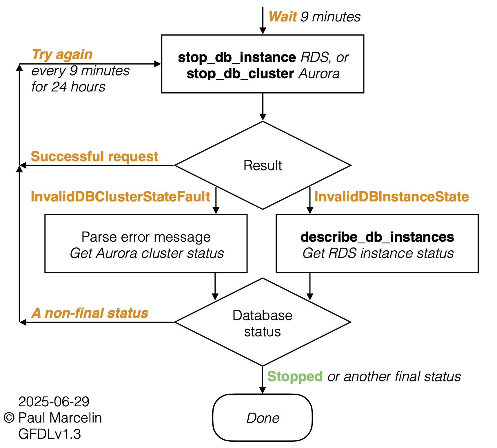

# Stay Stopped, RDS and Aurora!

Reliably keep AWS databases stopped when not needed, to save money

## Purpose

You can keep an EC2 compute instance stopped as long as you want, but it's not
possible to stop an RDS or Aurora database longer than 7 days. After AWS
starts your database on the 7th day, this tool automatically stops it again.

Stay-Stopped is for databases you use sporadically, perhaps for development
and testing. If it would cost too much to keep a database running but take too
long to re-create it, this tool might save you money, time, or both.

AWS does not charge for database instance hours while an
[RDS database instance is stopped](https://docs.aws.amazon.com/AmazonRDS/latest/UserGuide/USER_StopInstance.html#USER_StopInstance.Benefits)
or an
[Aurora database cluster is stopped](https://docs.aws.amazon.com/AmazonRDS/latest/AuroraUserGuide/aurora-cluster-stop-start.html#aurora-cluster-start-stop-overview).
(Other charges, such as for storage and snapshots, continue.)

Jump to:
[Get Started](#get-started)
&bull;
[Multi-Account, Multi-Region](#multi-account-multi-region)
&bull;
[Terraform](#terraform)
&bull;
[Security](#security)

## Design

[](media/stay-stopped-aws-rds-aurora-flow-simple.png "Simplified flowchart for Stay Stopped, RDS and Aurora!")

The design is simple but robust:

- You can start your database manually or on a schedule (check out
  [github.com/sqlxpert/lights-off-aws](/../../../lights-off-aws#lights-off)&nbsp;!),
  whenever you like.

- This tool only stops databases that _AWS_ is starting after they've been
  stopped for 7 days:
  [RDS-EVENT-0154](https://docs.aws.amazon.com/AmazonRDS/latest/UserGuide/USER_Events.Messages.html#RDS-EVENT-0154)
  (RDS database instance)
  and
  [RDS-EVENT-0153](https://docs.aws.amazon.com/AmazonRDS/latest/AuroraUserGuide/USER_Events.Messages.html#RDS-EVENT-0153)
  (Aurora database cluster).
  You do not need to set any opt-in or opt-out tags. As long as _you_, rather
  than _AWS_, started your database this time, Stay-Stopped won't stop it.

- Stopping stuff is inherently idempotent: keep trying until it stops! This
  tool tries every 9 minutes until the database is stopped, an unexpected
  error occurs, or 24 hours pass.

  > Some alternatives introduce a latent bug (a
  [race condition](https://en.wikipedia.org/wiki/Race_condition))
  by checking whether a database is ready _before_ trying to stop it,
  insisting on catching the database while it's `available`, or not waiting
  long enough.

  <details>
    <summary>Why should you care? More about idempotence and latent bugs...</summary>

  Here are two interesting alternative solutions, described as of May, 2025:

   1. [Stop Amazon RDS/Aurora Whenever They Start](https://aws.plainenglish.io/stop-amazon-rds-aurora-whenever-they-start-with-lambda-and-eventbridge-c8c1a88f67d6)
      \[[code](https://gist.github.com/shimo164/cc9bb3c425e13f0f2fa14f29c633aa84/0e714a830352e6e6d29904e0629b82df5473393f)\]
      by shimo, from the _AWS In Plain English_ blog on Medium, comprises a
      single Lambda function, which checks that the database is `available`
      before stopping it
      ([L48-L51](https://gist.github.com/shimo164/cc9bb3c425e13f0f2fa14f29c633aa84/0e714a830352e6e6d29904e0629b82df5473393f#file-lambda_stop_rds-py-L48-L51)).
      If not, the code waits
      ([L63-L65](https://gist.github.com/shimo164/cc9bb3c425e13f0f2fa14f29c633aa84/0e714a830352e6e6d29904e0629b82df5473393f#file-lambda_stop_rds-py-L63-L65))
      and checks again
      ([L76-L78](https://gist.github.com/shimo164/cc9bb3c425e13f0f2fa14f29c633aa84/0e714a830352e6e6d29904e0629b82df5473393f#file-lambda_stop_rds-py-L76-L78)).
      What if the database takes a long time to start? Startup "can take
      minutes to hours", according to the
      [RDS User Guide](https://docs.aws.amazon.com/AmazonRDS/latest/UserGuide/USER_StartInstance.html).
      What if the database goes from `available` to `maintenance`, or another
      similar status, _before_ the next status check?
      [Lambda has a 15-minute maximum timeout](https://docs.aws.amazon.com/lambda/latest/dg/configuration-timeout.html).

      Waiting _within_ the Lambda function might seem wasteful, but the cost
      is less than 2¢ &mdash; negligible for a function triggered once per
      database per week. AWS Lambda's maximum timeout notwithstanding, I
      appreciate the author's minimalist instinct.
  
   2. [Stopping an Automatically Started Database Instance](https://aws.amazon.com/jp/blogs/architecture/field-notes-stopping-an-automatically-started-database-instance-with-amazon-rds/)
      \[[code](https://github.com/aws-samples/amazon-rds-auto-restart-protection/tree/cfdd3a1)\]
      by Islam Ghanim, on AWS's own _Architecture Blog_, uses an AWS Step
      Function. Before attempting to stop the database, the state machine
      waits as long as necessary for the database to become `available`; long
      `maintenance` etc. would be covered. After the database finishes
      `starting` and becomes `available`, what if a person or system (perhaps
      an infrastructure-as-code system) happens to delete it before the next
      status check? That's unlikely, but what if someone notices that the
      database is now `available`, gets impatient, and stops it manually
      instead of waiting? Barring an error, `available` is the _only_ way out
      of the status-checking loop
      ([stop-rds-instance-state-machine.json, L30-L40](https://github.com/aws-samples/amazon-rds-auto-restart-protection/blob/cfdd3a1/sources/stepfunctions-code/stop-rds-instance-state-machine.json#L30-L40)).
      No
      [overall state machine timeout](https://docs.aws.amazon.com/step-functions/latest/dg/statemachine-structure.html#statemachinetimeoutseconds)
      is defined
      ([L1-L4](https://github.com/aws-samples/amazon-rds-auto-restart-protection/blob/cfdd3a1/sources/stepfunctions-code/stop-rds-instance-state-machine.json#L1-L4)).
      The Step Function would keep checking every 5 minutes for a status that
      won't recur until AWS starts the database again in 7 days or, worse yet,
      someone starts the database manually _with the intention of using it_.

      What I appreciate about this author's solution is that once the stop
      request is made, the state machine sees it through until the database's
      status changes from `stopping` to `stopped`.

      

  These examples demonstrate that a distributed computing problem like
  stopping a cloud database is not simple. Moreover, each professional who
  tackles a complex problem contributes a piece of the puzzle. By publishing
  our work on an open-source basis, we can learn from each other. Please get
  in touch if you have ideas for improving Stay-Stopped!

  For further reading:

  - [Making retries safe with idempotent APIs](https://aws.amazon.com/builders-library/making-retries-safe-with-idempotent-APIs/)
    by Malcolm Featonby, in the _Amazon Builder's Library_.

  - [Idempotence: Doing It More than Once](https://sqlxpert.github.io/2025/05/17/idempotence-doing-it-more-than-once.html),
    by yours truly.

  </details>

- It's not enough to call `stop_db_instance` or `stop_db_cluster` and hope for
  the best. This tool handles error cases. Look for a queue message or a log
  entry, in case something unexpected prevented stopping your database.
  [Budget alerts](https://docs.aws.amazon.com/cost-management/latest/userguide/budgets-action-configure.html)
  and
  [cost anomaly detection](https://docs.aws.amazon.com/cost-management/latest/userguide/manage-ad.html)
  are still essential.

- Once in a while it's still important to start a database before its
  maintenance window and leave it running until the window closes.

### Detailed Diagram

<details>
  <summary>Architecture diagram and flowchart...</summary>

[](media/stay-stopped-aws-rds-aurora-architecture-and-flow.png "Architecture diagram and flowchart for Stay Stopped, RDS and Aurora!")

</details>

## Get Started

 1. Log in to the AWS Console as an administrator. Choose an AWS account and a
    region where you have an RDS or Aurora database that is normally stopped,
    or that you can stop now and leave stopped for 8 days.

 2. Create a
    [CloudFormation stack](https://console.aws.amazon.com/cloudformation/home)
    "With new resources (standard)". Select "Upload a template file", then
    select "Choose file" and navigate to a locally-saved copy of
    [stay_stopped_rds_aurora.yaml](/stay_stopped_aws_rds_aurora.yaml?raw=true)
    [right-click to save as...]. On the next page, set:

    - Stack name: `StayStoppedRdsAurora`

 3. Wait 8 days, then check that your
    [RDS or Aurora database](https://console.aws.amazon.com/rds/home#databases:)
    is in the stopped state. So much for a "quick" start! If you don't want to
    wait, see
    [Testing](#testing),
    below.

 4. Optional: Double-check in the
    [StayStopped CloudWatch log group](https://console.aws.amazon.com/cloudwatch/home#logsV2:log-groups$3FlogGroupNameFilter$3DStayStoppedRdsAurora-).

## Multi-Account, Multi-Region

For reliability, Stay-Stopped works completely independently in each region, in
each AWS account. To deploy in multiple regions and/or AWS accounts,

 1. Delete any standalone `StayStoppedRdsAurora` CloudFormation _stacks_ in
    your target regions and/or AWS accounts.

 2. Complete the prerequisites for creating a _StackSet_ with
    [service-managed permissions](https://docs.aws.amazon.com/AWSCloudFormation/latest/UserGuide/stacksets-orgs-enable-trusted-access.html).

 3. In the management AWS account (or a delegated administrator account),
    create a
    [CloudFormation StackSet](https://console.aws.amazon.com/cloudformation/home#/stacksets).
    Select "Upload a template file", then select "Choose file" and upload a
    locally-saved copy of
    [stay_stopped_rds_aurora.yaml](/stay_stopped_aws_rds_aurora.yaml?raw=true)
    [right-click to save as...]. On the next page, set:

    - StackSet name: `StayStoppedRdsAurora`

 4. Two pages later, under "Deployment targets", select "Deploy to
    Organizational Units". Enter your target `ou-` identifier. Stay-Stopped
    will be deployed in all AWS accounts in your target OU. Toward the bottom
    of the page, specify your target region(s).

## Terraform

Terraform users are often willing to wrap a CloudFormation stack in HashiCorp
Configuration Language, because AWS supplies tools in the form of
CloudFormation templates. See
[aws_cloudformation_stack](https://registry.terraform.io/providers/hashicorp/aws/latest/docs/resources/cloudformation_stack)
.

Wrapping a CloudFormation StackSet in HCL is much easier than configuring and
using Terraform to deploy and maintain identical resources in multiple regions
and/or AWS accounts. See
[aws_cloudformation_stack_set](https://registry.terraform.io/providers/hashicorp/aws/latest/docs/resources/cloudformation_stack_set)
.

## Security

_In accordance with the software license, nothing in this section establishes
indemnification, a warranty, assumption of liability, etc. Use this software
entirely at your own risk. Paul encourages you to review the source code._

<details>
  <summary>Security details...</summary>

### Security Design Goals

- A least-privilege role for the AWS Lambda function.

- Least-privilege queue policies. The main queue can only consume messages
  from EventBridge and produce messages for the Lambda function, or for the
  error (dead letter) queue if there is a problem. Encryption in transit is
  required.

- Optional encryption at rest with the AWS Key Management System, for the
  queues and the log. This can protect EventBridge events containing database
  identifiers and metadata, such as tags. KMS keys housed in a different AWS
  account, and multi-region keys, are supported.

- No data storage other than in the queues and the log, both of which have
  configurable retention periods.

- A retry mechanism (every 9 minutes) and a time limit (24 hours), to increase
  the likelihood that a database will be stopped as intended.

- A concurrency limit, to prevent exhaustion of available Lambda resources.

- Readable Identity and Access Management policies, formatted as
  CloudFormation YAML rather than JSON, and broken down into discrete
  statements by service, resource or principal.

### Your Security Steps

- Prevent people from modifying components of this tool, most of which can be
  identified by `StayStoppedRdsAurora` in ARNs and in the automatic
  `aws:cloudformation:stack-name` tag.

- Log infrastructure changes using CloudTrail, and set up alerts.

- Prevent people from directly invoking the Lambda function and from passing
  the function role to arbitrary functions.

- Separate production workloads. Although this tool only stops databases that
  _AWS_ is starting after they've been stopped for 7 days, the Lambda function
  could stop _any_ database if invoked directly, with a contrived event as
  input. You might choose not to deploy this tool in AWS accounts used for
  production, or you might add a custom IAM policy to the function role,
  denying authority to stop certain production databases (`AttachLocalPolicy`
  in CloudFormation).

- Enable the test mode only in a non-critical AWS account and region, and turn
  the test mode off again as quickly as possible.

- Monitor the error (dead letter) queue, and monitor the log for `ERROR`-level
  entries.

- Configure [budget alerts](https://docs.aws.amazon.com/cost-management/latest/userguide/budgets-action-configure.html)
  and use
  [cost anomaly detection](https://docs.aws.amazon.com/cost-management/latest/userguide/manage-ad.html).

- Occasionally start a database before its maintenance window and leave it
  running, to catch up with RDS and Aurora security updates.

</details>

## Troubleshooting

Check the:

- [StayStopped CloudWatch log group](https://console.aws.amazon.com/cloudwatch/home#logsV2:log-groups$3FlogGroupNameFilter$3DStayStoppedRdsAurora-)
  - Scrutinize log entries at the `ERROR` level:

    `InvalidDBInstanceState` or `InvalidDBClusterStateFault` :

    - One time:
      A database could not be stopped because it was in an unexpected state.
    - Multiple times for the same database:
      The database was in an unexpected but potentially recoverable state.
      Stay-Stopped retries every 9 minutes, until 24 hours have passed.

  - Log entries are JSON objects.
    - Stay-Stopped includes `"level"` , `"type"` and `"value"` keys.
    - Other software components may use different keys.
  - For more data, change the `LogLevel` in CloudFormation.
- `ErrorQueue` (dead letter)
  [SQS queue](https://console.aws.amazon.com/sqs/v3/home#/queues)
  - The presence of a message in this queue means that Stay-Stopped did not
    stop a database, usually after trying for 24 hours.
  - The message will usually be the original EventBridge event from when AWS
    started the database after it had been stopped for 7 days.
  - Different message types are possible in rare cases, such as if cricial
    Stay-Stopped components have been modified or deleted, or the local
    security configuration denies EventBridge permission to send an event
    message to the main SQS queue or denies SQS permission to invoke the AWS
    Lambda function.
- [CloudTrail Event history](https://console.aws.amazon.com/cloudtrailv2/home?ReadOnly=false/events?ReadOnly=false)
  - CloudTrail events with an "Error code" may indicate permissions problems,
    typically due to the local security configuration.
  - To see more events, change "Read-only" from `false` to `true` .

## Testing

<details>
  <summary>Testing details...</summary>

### Recommended Test Database

An RDS database instance ( `db.t4g.micro` , `20` GiB of gp3 storage, `0` days'
worth of automated backups) is cheaper than a typical Aurora cluster, not to
mention faster to create, stop, and start.

### Test Mode

AWS starts RDS and Aurora databases that have been stopped for 7 days, but we
need a faster mechanism for realistic, end-to-end testing. Temporarily change
these parameters in CloudFormation:

|Parameter|Normal|Test|
|:---|:---:|:---:|
|`Test`|`false`|`true`|
|`LogLevel`|`ERROR`|`INFO`|
|`QueueVisibilityTimeoutSecs`|`540`|`60`|
||Retry every 9 minutes|Retry every 1 minute|
|`QueueMaxReceiveCount`|`160`|`30`|
||24 hours, at one retry every 9 minutes|30 minutes, at one retry every 1 minute|

Given the operational and security risks explained below, **exit test mode as
quickly as possible**. If your test database is ready, several minutes should
be sufficient.

### Test by Manually Starting a Database

In test mode, Stay-Stopped responds to user-initiated, non-forced database
starts, too:
[RDS-EVENT-0088 (RDS database instance)](https://docs.aws.amazon.com/AmazonRDS/latest/UserGuide/USER_Events.Messages.html#RDS-EVENT-0088)
and
[RDS-EVENT-0151](https://docs.aws.amazon.com/AmazonRDS/latest/AuroraUserGuide/USER_Events.Messages.html#USER_Events.Messages.cluster)
(Aurora database cluster). Although Stay-Stopped won't stop databases that
are already running and remain running, in test mode it **will stop any
database that you create or start** &#9888;. To test, manually start a stopped
[RDS or Aurora database](https://console.aws.amazon.com/rds/home#databases:).

> In test mode, Stay-Stopped also receives
[RDS-EVENT-0088 (Aurora database instance)](https://docs.aws.amazon.com/AmazonRDS/latest/AuroraUserGuide/USER_Events.Messages.html#RDS-EVENT-0088).
Internally, the code ignores it in favor of the cluster-level event.

### Test by Sending a Message

Test mode relaxes the queue policy for the main SQS queue, allowing sources
other than EventBridge, and targets other than the Lambda function or the
error (dead letter) queue. Test by using the AWS Console to send a simulated
EventBridge event message. In the list of
[SQS queues](https://console.aws.amazon.com/sqs/v3/home#/queues),
select `StayStoppedRdsAurora-MainQueue` and then select the "Send and receive
messages" button above the list. You can:

- "Send message", or
- "Poll for messages", select a message, read it and delete it, or
- "Purge" all messages.

Edit the database names in these test messages:

```json
{
  "detail": {
    "SourceIdentifier": "NAME_OF_YOUR_RDS_DATABASE_INSTANCE",
    "SourceType": "DB_INSTANCE",
    "EventID": "RDS-EVENT-0154"
  },
  "detail-type": "RDS DB Instance Event",
  "source": "aws.rds",
  "version": "0"
}
```

```json
{
  "detail": {
    "SourceIdentifier": "NAME_OF_YOUR_AURORA_DATABASE_INSTANCE",
    "SourceType": "CLUSTER",
    "EventID": "RDS-EVENT-0153"
  },
  "detail-type": "RDS DB Cluster Event",
  "source": "aws.rds",
  "version": "0"
}
```

### Test by Invoking the Lambda Function

Depending on locally-determined permissions, you may also be able to invoke
the
[StayStopped Lambda function](https://console.aws.amazon.com/lambda/home#/functions?fo=and&o0=%3A&v0=StayStoppedRdsAurora-LambdaFn-)
manually. Edit the database names in this Lambda test event:

```json
{
  "Records": [
    {
      "body": "{ \"detail\": { \"SourceIdentifier\": \"NAME_OF_YOUR_RDS_DATABASE_INSTANCE\", \"SourceType\": \"DB_INSTANCE\", \"EventID\": \"RDS-EVENT-0154\" }, \"detail-type\": \"RDS DB Instance Event\", \"source\": \"aws.rds\", \"version\": \"0\"}",
      "messageId": "test-message-1-rds"
    },
    {
      "body": "{ \"detail\": { \"SourceIdentifier\": \"NAME_OF_YOUR_AURORA_DATABASE_INSTANCE\", \"SourceType\": \"CLUSTER\", \"EventID\": \"RDS-EVENT-0153\" }, \"detail-type\": \"RDS DB Cluster Event\", \"source\": \"aws.rds\", \"version\": \"0\"}",
      "messageId": "test-message-2-aurora"
    }
  ]
}
```

### Report Bugs

After following the
[troubleshooting](#troubleshooting)
steps and ruling out local issues such as permissions &mdash; especially
hidden controls such as Service and Resource control policies (SCPs and RCPs)
&mdash; please
[report bugs](/../../issues). Thank you!

</details>

## Licenses

|Scope|Link|Included Copy|
|:---|:---|:---|
|Source code, and source code in documentation|[GNU General Public License (GPL) 3.0](http://www.gnu.org/licenses/gpl-3.0.html)|[LICENSE-CODE.md](/LICENSE-CODE.md)|
|Documentation, including this ReadMe file|[GNU Free Documentation License (FDL) 1.3](http://www.gnu.org/licenses/fdl-1.3.html)|[LICENSE-DOC.md](/LICENSE-DOC.md)|

Copyright Paul Marcelin

Contact: `marcelin` at `cmu.edu` (replace "at" with `@`)
